# WE Health

WE Health is a women-focused health tracking and peer-support platform that combines personal daily check-ins with community interaction and cohort-style insights.

## Project Goal

Build a safe and practical digital space where women can:

- Track daily physical and emotional changes.
- Identify patterns in mood, energy, sleep, and symptoms.
- Learn from women with similar symptom profiles ("Women Like Me").
- Share experiences and support each other through a moderated community feed.

## Core Features

- Authentication and account flows
	- Register with email, username, and password
	- Login with email or username
	- OTP-based email verification for registration
	- Forgot password and reset password with OTP
- Daily health tracking
	- Symptoms (comma-separated, normalized on backend)
	- Mood score, energy level, sleep hours
	- Body changes, emotions, and notes
- Insights
	- Women-like-me symptom cohort analysis
	- Co-occurring symptom suggestions from similar users
- Community
	- Create posts with optional image URL
	- Like/unlike posts
	- Add and read comments

## Tech Stack

- Frontend: HTML, CSS, Vanilla JavaScript
- Backend: Node.js, Express
- Database: PostgreSQL
- Auth: JWT
- Email/OTP: Nodemailer (Gmail or compatible SMTP)

## Repository Structure

The project currently contains the following important files and directories:

```text
WeHealth/
|-- README.md
|-- .gitignore
|-- .postman/
|   `-- resources.yaml
|-- backend/
|   |-- .env
|   |-- db.js
|   |-- package.json
|   |-- server.js
|   |-- middleware/
|   |   `-- auth.js
|   |-- public/
|   |   |-- index.html
|   |   `-- script.js
|   |-- routes/
|   |   |-- auth.js
|   |   |-- checkins.js
|   |   |-- community.js
|   |   |-- menotype.js
|   |   `-- symptoms.js
|   `-- utils/
|       `-- sendEmail.js
|-- database/
|   |-- create_frontend_v1_tables.sql
|   `-- create_password_reset_table.sql
`-- postman/
		|-- collections/
		|-- environments/
		|-- flows/
		|-- globals/
		|   `-- workspace.globals.yaml
		`-- specs/
```

## Prerequisites

- Node.js 18+
- npm 9+
- PostgreSQL 13+

## Environment Configuration

Create or update backend/.env with:

```env
DB_HOST=localhost
DB_PORT=5432
DB_USER=your_postgres_user
DB_PASSWORD=your_postgres_password
DB_NAME=wehealth
DB_SSL=false

JWT_SECRET=replace_with_a_long_random_secret
NODE_ENV=development

# Optional for real email sending
EMAIL_USER=your_email@gmail.com
EMAIL_PASS=your_email_app_password
```

Notes:

- If EMAIL_USER and EMAIL_PASS are not set, OTP is still usable in development flows where returned by API.
- For Azure PostgreSQL, DB_SSL is often true.

## Database Setup

Run the provided SQL scripts:

```bash
psql -d wehealth -f ./database/create_frontend_v1_tables.sql
psql -d wehealth -f ./database/create_password_reset_table.sql
```

Important:

- The code also expects users, otp_codes, symptom_dictionary, and symptom_mapping tables.
- Ensure these base tables exist before running the app (from your main schema/migrations).

## Database Schema (Live DB Audit)

This section documents the current `public` schema in the connected database (`wehealth_v2`) and includes all detected tables, columns, relationships, and why each table exists.

### Enforced Foreign-Key Relationships

- `community_posts.user_id -> users.user_id` (ON DELETE CASCADE)
- `entry_symptoms_normalized.entry_id -> entries.entry_id` (ON DELETE NO ACTION)
- `entry_symptoms_normalized.symptom_id -> symptom_dictionary.symptom_id` (ON DELETE NO ACTION)
- `post_comments.post_id -> community_posts.post_id` (ON DELETE CASCADE)
- `post_comments.user_id -> users.user_id` (ON DELETE CASCADE)
- `post_likes.post_id -> community_posts.post_id` (ON DELETE CASCADE)
- `post_likes.user_id -> users.user_id` (ON DELETE CASCADE)
- `user_checkins.user_id -> users.user_id` (ON DELETE CASCADE)

### Table Catalog (All Public Tables)

1. `comment_events_normalized`
   Columns: `id`, `event_id`, `comment_id`, `entry_id`, `treatment_id`, `symptom_id`, `outcome`, `evidence_type`.
   Significance: Structured treatment/symptom outcome events extracted from comments for analytics.

2. `comment_treatment_events`
   Columns: `event_id`, `comment_id`, `entry_id`, `treatment`, `symptom`, `outcome`, `evidence_type`.
   Significance: Parsed treatment-event staging table before dictionary normalization.

3. `comments`
   Columns: `comment_id`, `entry_id`, `comment_text`, `comment_clean`.
   Significance: Raw/clean comment text attached to imported entries.

4. `community_posts`
   Columns: `post_id`, `user_id`, `content`, `image_url`, `created_at`, `updated_at`.
   Significance: Main social feed posts created by authenticated users.

5. `entries`
   Columns: `entry_id`, `post_id`, `emotional_state`, `timeframe`, `primary_issue`, `age`, `age_range`, `age_at_menopause`, `years_since_menopause`, `menopause_stage`, `stage_confidence`.
   Significance: Canonicalized narrative-entry records used for symptom/treatment mining.

6. `entries_clean`
   Columns: `entry_id`, `post_id`, `emotional_state`, `timeframe`, `primary_issue`, `age`, `age_range`, `age_at_menopause`, `years_since_menopause`, `menopause_stage`, `stage_confidence`.
   Significance: Cleaned/processed mirror of entries for quality-controlled analysis.

7. `entry_symptoms`
   Columns: `entry_id`, `symptom`.
   Significance: Non-normalized symptom mentions extracted from entries.

8. `entry_symptoms_normalized`
   Columns: `entry_id`, `symptom_id`.
   Significance: Bridge table linking entries to canonical symptoms in symptom dictionary.

9. `menotypes`
   Columns: `entry_id`, `menotype`.
   Significance: Menotype classification labels per entry.

10. `otp_codes`
	Columns: `email`, `otp`, `expires_at`.
	Significance: Time-bound OTP storage for registration and login/recovery flows.

11. `post_comments`
	Columns: `comment_id`, `post_id`, `user_id`, `content`, `created_at`.
	Significance: Community comments authored by users under social posts.

12. `post_likes`
	Columns: `post_id`, `user_id`, `created_at`.
	Significance: Many-to-many like interaction table between users and community posts.

13. `raw_entries`
	Columns: `entry_id`, `subreddit`, `post_id`, `title`, `post_text`, `score`, `created_utc`, `url`, `num_comments`, `comments`.
	Significance: Raw imported source data used to build curated menopause datasets.

14. `raw_posts`
	Columns: `post_id`, `subreddit`, `title`, `post_text`, `comments`.
	Significance: Original post-level ingestion table before detailed parsing.

15. `symptom_dictionary`
	Columns: `symptom_id`, `canonical_symptom`.
	Significance: Master list of canonical symptom terms used for normalization.

16. `symptom_mapping`
	Columns: `raw_symptom`, `canonical_symptom`.
	Significance: Maps free-text symptom variants to canonical symptom names.

17. `symptom_matrix`
	Columns: `entry_id`, `hot_flashes`, `sleep`, `anxiety`, `depression`, `brain_fog`, `mood_swings`, `fatigue`, `pain`, `headaches`, `palpitations`, `vaginal_dryness`, `libido`, `irregular_periods`, `weight_changes`, `hair_skin`, `digestive`, `urinary`, `breast_pain`, `dizziness`, `tingling`, `suicidal`, `memory_loss`, `temperature`.
	Significance: Wide feature table encoding symptom presence/intensity by entry.

18. `symptom_matrix_clean`
	Columns: `entry_id`, `hot_flashes`, `sleep`, `anxiety`, `depression`, `brain_fog`, `mood_swings`, `fatigue`, `pain`, `headaches`, `palpitations`, `vaginal_dryness`, `libido`, `irregular_periods`, `weight_changes`, `hair_skin`, `digestive`, `urinary`, `breast_pain`, `dizziness`, `tingling`, `suicidal`, `memory_loss`, `temperature`, `menotype`.
	Significance: Cleaned feature matrix with class label for analysis/training.

19. `symptom_matrix_clustered`
	Columns: `entry_id`, `hot_flashes`, `sleep`, `anxiety`, `depression`, `brain_fog`, `mood_swings`, `fatigue`, `pain`, `headaches`, `palpitations`, `vaginal_dryness`, `libido`, `irregular_periods`, `weight_changes`, `hair_skin`, `digestive`, `urinary`, `breast_pain`, `dizziness`, `tingling`, `suicidal`, `memory_loss`, `temperature`, `menotype`.
	Significance: Clustered/model-ready symptom matrix used by menotype route logic.

20. `symptom_synonyms`
	Columns: `raw_symptom`, `symptom_id`.
	Significance: Alternate symptom phrases tied to canonical symptom IDs.

21. `treatment_comments`
	Columns: `comment_id`, `entry_id`, `comment_clean`.
	Significance: Treatment-focused cleaned comment corpus for downstream extraction.

22. `treatment_dictionary`
	Columns: `treatment_id`, `canonical_treatment`.
	Significance: Master list of normalized treatment names.

23. `treatment_events`
	Columns: `event_id`, `entry_id`, `treatment`, `worked`, `discontinued`.
	Significance: Parsed treatment outcome events from entries/comments.

24. `treatment_events_normalized`
	Columns: `entry_id`, `treatment_id`, `worked`, `discontinued`.
	Significance: Normalized treatment outcomes linked to treatment dictionary IDs.

25. `treatment_mapping`
	Columns: `raw_treatment`, `canonical_treatment`, `treatment_id`.
	Significance: Mapping from user/raw treatment text to canonical treatment entities.

26. `treatment_side_effects`
	Columns: `event_id`, `side_effect`.
	Significance: Side-effect details attached to treatment events.

27. `treatment_synonyms`
	Columns: `raw_treatment`, `treatment_id`.
	Significance: Synonym lookup table to improve treatment normalization.

28. `user_checkins`
	Columns: `checkin_id`, `user_id`, `mood_score`, `energy_level`, `sleep_hours`, `symptoms`, `body_changes`, `emotions`, `notes`, `created_at`, `updated_at`.
	Significance: Core app table for daily check-ins and women-like-me insights.

29. `users`
	Columns: `user_id`, `email`, `created_at`, `username`, `password`, `updated_at`, `reset_token`, `reset_token_expires_at`.
	Significance: Account identity table and auth/password-reset source of truth.

### Practical Relationship Model (Application View)

- One `users` record has many `user_checkins`, `community_posts`, `post_comments`, and `post_likes`.
- One `community_posts` record has many `post_comments` and `post_likes`.
- One `entries` record has many `entry_symptoms_normalized` rows and can map to one `menotypes` label.
- `symptom_dictionary` and `treatment_dictionary` are canonical dimensions used by normalization and analytics tables.

### ERD (Entity Relationship Diagram)

```mermaid
erDiagram
	USERS {
		uuid user_id PK
		text email
		varchar username
		text password
		text reset_token
		timestamp reset_token_expires_at
		timestamp created_at
		timestamp updated_at
	}

	OTP_CODES {
		text email
		text otp
		timestamp expires_at
	}

	USER_CHECKINS {
		bigint checkin_id PK
		uuid user_id FK
		smallint mood_score
		smallint energy_level
		numeric sleep_hours
		text[] symptoms
		text body_changes
		text emotions
		text notes
		timestamp created_at
		timestamp updated_at
	}

	COMMUNITY_POSTS {
		bigint post_id PK
		uuid user_id FK
		text content
		text image_url
		timestamp created_at
		timestamp updated_at
	}

	POST_COMMENTS {
		bigint comment_id PK
		bigint post_id FK
		uuid user_id FK
		text content
		timestamp created_at
	}

	POST_LIKES {
		bigint post_id FK
		uuid user_id FK
		timestamp created_at
	}

	ENTRIES {
		int entry_id PK
		text post_id
		text emotional_state
		text timeframe
		text primary_issue
		int age
		text age_range
		int age_at_menopause
		int years_since_menopause
		text menopause_stage
		text stage_confidence
	}

	ENTRY_SYMPTOMS_NORMALIZED {
		int entry_id FK
		int symptom_id FK
	}

	MENOTYPES {
		int entry_id
		int menotype
	}

	SYMPTOM_DICTIONARY {
		int symptom_id PK
		text canonical_symptom
	}

	SYMPTOM_MAPPING {
		text raw_symptom
		text canonical_symptom
	}

	SYMPTOM_SYNONYMS {
		text raw_symptom
		int symptom_id
	}

	TREATMENT_DICTIONARY {
		int treatment_id PK
		text canonical_treatment
	}

	TREATMENT_MAPPING {
		text raw_treatment
		text canonical_treatment
		int treatment_id
	}

	TREATMENT_SYNONYMS {
		text raw_treatment
		int treatment_id
	}

	TREATMENT_EVENTS {
		int event_id PK
		int entry_id
		text treatment
		boolean worked
		boolean discontinued
	}

	TREATMENT_EVENTS_NORMALIZED {
		int entry_id
		int treatment_id
		boolean worked
		boolean discontinued
	}

	TREATMENT_SIDE_EFFECTS {
		int event_id
		text side_effect
	}

	COMMENTS {
		int comment_id PK
		int entry_id
		text comment_text
		text comment_clean
	}

	TREATMENT_COMMENTS {
		int comment_id
		int entry_id
		text comment_clean
	}

	COMMENT_TREATMENT_EVENTS {
		int event_id PK
		int comment_id
		int entry_id
		text treatment
		text symptom
		text outcome
		text evidence_type
	}

	COMMENT_EVENTS_NORMALIZED {
		int id PK
		int event_id
		int comment_id
		int entry_id
		int treatment_id
		int symptom_id
		text outcome
		text evidence_type
	}

	RAW_POSTS {
		text post_id PK
		text subreddit
		text title
		text post_text
		text comments
	}

	RAW_ENTRIES {
		int entry_id PK
		text subreddit
		text post_id
		text title
		text post_text
		int score
		float created_utc
		text url
		int num_comments
		text comments
	}

	ENTRIES_CLEAN {
		int entry_id
		text post_id
		text emotional_state
		text timeframe
		text primary_issue
		int age
		text age_range
		int age_at_menopause
		int years_since_menopause
		text menopause_stage
		text stage_confidence
	}

	ENTRY_SYMPTOMS {
		int entry_id
		text symptom
	}

	SYMPTOM_MATRIX {
		int entry_id
		int hot_flashes
		int sleep
		int anxiety
		int depression
		int brain_fog
		int mood_swings
		int fatigue
		int pain
		int headaches
		int palpitations
		int vaginal_dryness
		int libido
		int irregular_periods
		int weight_changes
		int hair_skin
		int digestive
		int urinary
		int breast_pain
		int dizziness
		int tingling
		int suicidal
		int memory_loss
		int temperature
	}

	SYMPTOM_MATRIX_CLEAN {
		int entry_id
		int menotype
	}

	SYMPTOM_MATRIX_CLUSTERED {
		int entry_id
		int menotype
	}

	USERS ||--o{ USER_CHECKINS : has
	USERS ||--o{ COMMUNITY_POSTS : creates
	USERS ||--o{ POST_COMMENTS : writes
	USERS ||--o{ POST_LIKES : likes

	COMMUNITY_POSTS ||--o{ POST_COMMENTS : has
	COMMUNITY_POSTS ||--o{ POST_LIKES : has

	ENTRIES ||--o{ ENTRY_SYMPTOMS_NORMALIZED : contains
	SYMPTOM_DICTIONARY ||--o{ ENTRY_SYMPTOMS_NORMALIZED : categorizes

	ENTRIES ||--o{ MENOTYPES : classified_as
	ENTRIES ||--o{ TREATMENT_EVENTS : treatment_events
	ENTRIES ||--o{ TREATMENT_EVENTS_NORMALIZED : normalized_events
	ENTRIES ||--o{ ENTRY_SYMPTOMS : raw_symptoms
	ENTRIES ||--o{ COMMENTS : source_comments

	TREATMENT_DICTIONARY ||--o{ TREATMENT_EVENTS_NORMALIZED : canonical_treatment
	TREATMENT_EVENTS ||--o{ TREATMENT_SIDE_EFFECTS : side_effects

	SYMPTOM_DICTIONARY ||--o{ SYMPTOM_SYNONYMS : synonym_of
	TREATMENT_DICTIONARY ||--o{ TREATMENT_SYNONYMS : synonym_of

	RAW_POSTS ||--o{ RAW_ENTRIES : source
```



## Install and Run (Manual)

From project root:

```bash
cd backend
npm install
node server.js
```

Expected startup logs:

- WE Health API running on port 3000
- Connected to DB: your_database_name

Open in browser:

http://localhost:3000

## API Overview

Public auth routes:

- POST /auth/register
- POST /auth/login
- POST /auth/request-otp
- POST /auth/verify-otp
- POST /auth/verify-registration-otp
- POST /auth/forgot-password
- POST /auth/reset-password

Protected routes (Bearer token required):

- GET /symptoms
- POST /symptoms/women-like-me
- POST /menotype
- GET /checkins
- POST /checkins
- GET /community/posts
- POST /community/posts
- POST /community/posts/:postId/like
- GET /community/posts/:postId/comments
- POST /community/posts/:postId/comments

## Typical User Flow

1. User opens landing page and registers.
2. User verifies account with OTP.
3. User logs in and receives JWT.
4. User submits daily check-ins.
5. User receives cohort insights from similar symptoms.
6. User posts and interacts in the community feed.

## Known Setup Caveats

- backend/package.json currently has no start/dev script. Use node server.js directly.
- Ensure JWT_SECRET is always set; protected routes and login tokens depend on it.
- Keep backend/.env out of version control in real deployments.

## Future Improvements

- Add npm scripts: start, dev, and test
- Add DB migration tooling (for complete reproducible setup)
- Add automated tests for auth, check-ins, and community routes
- Add API docs (OpenAPI/Swagger)
- Add deployment guides for staging/production